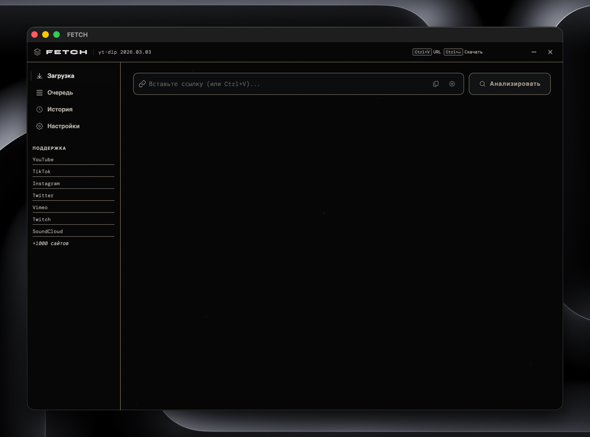
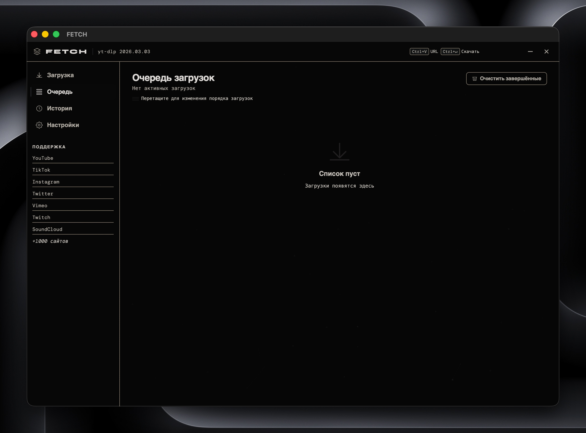

# FETCH — Media Downloader


Минималистичный десктоп-загрузчик медиа на Python + HTML с движком yt-dlp.  
Поддерживает **1000+ сайтов**, очередь загрузок, паузу/возобновление, метаданные и многое другое.

---

## Возможности

| Функция | Описание |
|---|---|
| 🎬 Видео до 4K | Выбор качества, формата (mp4/mkv/webm) и FPS |
| 🎵 Аудио | Экстракция в MP3, AAC, FLAC, WAV, Opus, M4A |
| 📋 Плейлисты | Пакетная загрузка с диапазоном треков |
| ⏸ Пауза / Возобновление | Прерывание без потери прогресса |
| 🔄 Очередь | Параллельные загрузки (до 10 одновременно) |
| 🏷 ID3-метаданные | Встраивание тегов, обложки, субтитров |
| 🖼 Превью | Скачивание обложки отдельным файлом |
| 🌐 Прокси | Поддержка HTTP/SOCKS прокси |
| 📁 Кастомный путь | Выбор папки сохранения через диалог ОС |
| 🕓 История | Сохраняется между сессиями (localStorage) |

---

## Скриншоты


<!--  -->
<!--  -->

---

## Установка

### Требования
- Python 3.9+
- FFmpeg (обязательно для слияния видео/аудио и конвертации)

### 1. Клонировать репозиторий

```bash
git clone https://github.com/whymewhyagain/fetch-media-downloader.git
cd fetch-media-downloader
```

### 2. Установить зависимости Python

```bash
pip install -r requirements.txt
```

### 3. Установить FFmpeg

**Windows:**
```bash
winget install ffmpeg
```
или скачать вручную с [ffmpeg.org](https://ffmpeg.org/download.html) и добавить в `PATH`.

**macOS:**
```bash
brew install ffmpeg
```

**Linux (Debian/Ubuntu):**
```bash
sudo apt install ffmpeg
```

### 4. Запустить

```bash
python app.py
```

Откроется окно приложения (порт 8888).

---

## Структура проекта

```
fetch-media-downloader/
├── app.py              # Python-бэкенд (eel + yt-dlp)
├── requirements.txt    # Python-зависимости
├── web/
│   ├── index.html      # Интерфейс
│   ├── style.css       # Стили (B&W минимализм)
│   └── app.js          # Логика frontend
└── screenshots/        # скриншоты для README
```

---

## Поддерживаемые платформы

YouTube · TikTok · Instagram · Twitter/X · Vimeo · Twitch · Dailymotion · SoundCloud · Reddit · и 1000+ других сайтов через движок [yt-dlp](https://github.com/yt-dlp/yt-dlp).

---

## Горячие клавиши

| Клавиша | Действие |
|---|---|
| `Ctrl+V` | Вставить URL |
| `Ctrl+Enter` | Начать загрузку |
| `Esc` | Очистить поле |

---

## Зависимости

- [eel](https://github.com/python-eel/Eel) — мост Python ↔ HTML/JS
- [yt-dlp](https://github.com/yt-dlp/yt-dlp) — движок загрузки медиа
- [FFmpeg](https://ffmpeg.org) — обработка и конвертация аудио/видео

---

## Лицензия

[MIT](LICENSE)
